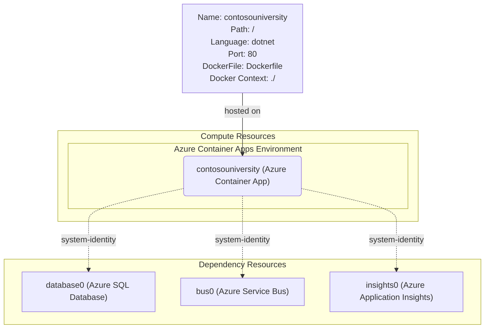

# Azure Architecture for Contoso University

> ?? **Note**: To view the diagram below, please install a Mermaid preview extension in your IDE.

## Architecture Diagram

## Architecture Overview

This architecture modernizes the Contoso University application for Azure deployment using cloud-native containerized services:

### Compute Layer
- **Azure Container Apps**: Hosts the .NET 9 ASP.NET Core application in containers with automatic scaling, zero-downtime deployments, and Kubernetes-based infrastructure
- **Container Apps Environment**: Provides secure networking, logging, and monitoring for the containerized application
- **Managed Identity**: Enables secure, credential-free authentication to Azure services

### Data Layer
- **Azure SQL Database**: Replaces SQL Server LocalDB with a fully managed, scalable cloud database
- **Connection Security**: Uses Managed Identity authentication instead of connection strings with credentials

### Messaging Layer
- **Azure Service Bus**: Replaces MSMQ for reliable messaging with cloud-native queuing
- **Queue Management**: Handles notification delivery with guaranteed message processing

### Observability Layer
- **Application Insights**: Provides comprehensive monitoring, logging, and performance analytics
- **Telemetry**: Collects application metrics, dependencies, and user behavior data

## Data Flow

1. **Container Deployment**: Application is packaged as a Docker container and deployed to Azure Container Apps
2. **User Requests**: Web traffic flows through the Container Apps ingress controller to the application container
3. **Database Operations**: Application connects to Azure SQL Database using Managed Identity for authentication
4. **Notifications**: Entity operations trigger messages sent to Azure Service Bus queues for reliable processing
5. **Monitoring**: All operations, container metrics, and application telemetry are tracked via Application Insights
6. **Auto-scaling**: Container Apps automatically scales containers based on HTTP traffic and resource utilization

## Key Benefits

- **Cloud-Native**: Fully containerized with Kubernetes-based orchestration
- **Auto-scaling**: Scale to zero and rapid scale-out based on demand
- **Security**: No stored credentials, Managed Identity throughout, network isolation
- **Reliability**: Built-in high availability, health checks, and automatic restarts
- **Observability**: Comprehensive monitoring of both container and application metrics
- **Cost Optimization**: Pay only for actual container usage, scale to zero when idle
- **DevOps Ready**: Perfect for CI/CD pipelines with container-based deployments