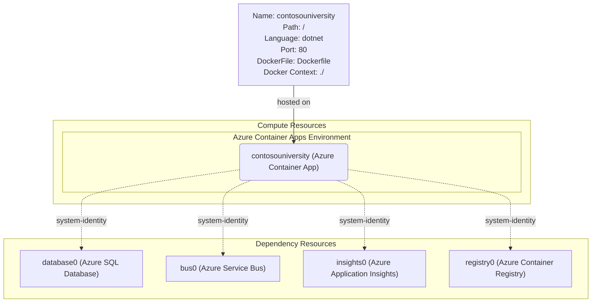

# Azure Deployment Plan for ContosoUniversity Project

## **Goal**
Deploy the modernized Contoso University .NET 9 application to Azure using AZD with containerized hosting and cloud-native services.

## **Project Information**

**AppName**: ContosoUniversity
- **Technology Stack**: .NET 9 ASP.NET Core MVC application (upgraded from .NET Framework)
- **Application Type**: University management system with CRUD operations for students, courses, instructors, and departments
- **Containerization**: Ready for deployment with optimized Dockerfile for .NET 9
- **Dependencies**: 
  - Azure SQL Database (replaces SQL Server LocalDB)
  - Azure Service Bus (replaces MSMQ messaging)
  - Application Insights for monitoring
- **Hosting Recommendation**: Azure Container Apps for auto-scaling, zero-downtime deployments, and cost-effective serverless container hosting
- **Key Features**: 
  - Entity Framework Core 9.0 with Code First migrations
  - Real-time notification system using Azure Service Bus
  - Bootstrap 5 responsive UI
  - Managed Identity authentication throughout

## **Azure Resources Architecture**

> **Install the mermaid extension in IDE to view the architecture.**



**Data Flow:**
- AZD builds the Docker image and pushes it to Azure Container Registry
- The Container App pulls the image from ACR using managed identity
- Web requests are routed through the Container Apps ingress controller to the application
- The application connects to Azure SQL Database using Managed Identity for secure, credential-free authentication
- Entity operations trigger notifications sent to Azure Service Bus queues for reliable message processing
- All telemetry, logs, and performance metrics are collected by Application Insights for monitoring and diagnostics
- Container Apps auto-scales based on HTTP traffic and resource utilization

## **Recommended Azure Resources**

### Application Services
**Application: ContosoUniversity**
- **Hosting Service Type**: Azure Container Apps
- **SKU**: Consumption-based pricing with auto-scaling (0.5 vCPU, 1Gi memory per container)
- **Configuration**:
  - Language: dotnet
  - DockerFilePath: ./Dockerfile
  - DockerContext: ./
  - Environment Variables:
    - `APPLICATIONINSIGHTS_CONNECTION_STRING`
    - `ConnectionStrings__DefaultConnection`
    - `NotificationQueue__ServiceBusNamespace`
    - `NotificationQueue__QueueName`

### Dependency Resources

**Azure Container Registry**
- **SKU**: Basic tier for container image storage
- **Service Type**: Azure Container Registry
- **Connection Type**: Managed Identity authentication
- **Purpose**: Store and serve Docker images for Container Apps

**Azure SQL Database**
- **SKU**: Basic tier (5 DTUs, 2GB storage) - suitable for development/testing
- **Service Type**: Azure SQL Database
- **Connection Type**: Managed Identity with Azure AD authentication
- **Environment Variables**: `ConnectionStrings__DefaultConnection`

**Azure Service Bus**
- **SKU**: Standard tier with messaging capabilities
- **Service Type**: Azure Service Bus Namespace with notifications queue
- **Connection Type**: Managed Identity authentication
- **Environment Variables**: 
  - `NotificationQueue__ServiceBusNamespace`
  - `NotificationQueue__QueueName`

### Supporting Services
- **Application Insights**: Standard tier for comprehensive monitoring and analytics
- **Log Analytics Workspace**: Centralized logging for all services
- **Container Apps Environment**: Managed Kubernetes environment for container orchestration

### Security Configurations
**Container App Security**:
- **User Managed Identity**: Automatically assigned to the Container App for secure service authentication
- **SQL Database Role**: SQL DB Contributor role assigned to the managed identity
- **Service Bus Role**: Azure Service Bus Data Owner role assigned to the managed identity
- **Container Registry Role**: AcrPull role assigned to the managed identity

## **Execution Steps**

> **? AZD SERVICE TAGGING FIXED - Ready for Deployment**

### **Prerequisites**
1. Install Azure Developer CLI (AZD): `winget install microsoft.azd`
2. Install Azure CLI: `winget install microsoft.azurecli`
3. Login to Azure: `azd auth login` and `az login`

### **Deployment Commands**

1. **Initialize AZD (if not done already):**
   ```bash
   azd init
   # Select "Use code in the current directory"
   # Confirm the azure.yaml configuration
   ```

2. **Deploy to Azure:**
   ```bash
   azd up
   ```
   This single command will:
   - ? Provision all Azure resources using Bicep templates
   - ? Create Azure Container Registry for image storage
   - ? Build the Docker container from your .NET 9 application
   - ? Push the container to Azure Container Registry
   - ? Deploy the container to Azure Container Apps with proper service tagging
   - ? Configure all managed identities and role assignments
   - ? Set up monitoring and logging

3. **Monitor Deployment:**
   ```bash
   azd monitor --overview
   azd monitor --logs
   ```

### **Post-Deployment Validation**
1. **Test Application:** Navigate to the Container App FQDN provided in deployment output
2. **Database Verification:** Test CRUD operations (Create/Read/Update/Delete) for Students, Courses, etc.
3. **Notification System:** Perform entity operations and verify Service Bus message processing
4. **Monitoring:** Check Application Insights for telemetry and performance data
5. **Health Checks:** Verify `/health` endpoint responds successfully

### **Troubleshooting**
- **View App Logs:** `azd monitor --logs`
- **Check Resources:** `az resource list --resource-group <rg-name>`
- **Container App Status:** `az containerapp show --name <app-name> --resource-group <rg-name>`
- **Registry Status:** `az acr repository list --name <registry-name>`

## **Infrastructure Summary**

### **? Created Files:**
- **Dockerfile**: Optimized multi-stage build for .NET 9
- **azure.yaml**: AZD configuration for automated deployment
- **infra/main.bicep**: Main infrastructure template (? Fixed)
- **infra/main.parameters.json**: Parameter file for deployment
- **infra/core/**: Modular Bicep templates for each service
- **infra/core/host/container-registry.bicep**: ? Added for ACR support
- **.dockerignore**: Optimized Docker build context

### **? Fixed Issues:**
- **AZD Service Tagging**: ? Added `azd-service-name: web` tag to Container App
- **Container Registry**: ? Added Azure Container Registry for image storage and deployment
- **Container Registry Naming**: ? Fixed ACR name to use alphanumeric characters only (no hyphens)
- **Service Tagging Error**: ? Fixed "resource not found: unable to find a resource tagged with 'azd-service-name: web'"
- **ResourceNameInvalid Error**: ? Fixed "Invalid resource name: 'cr-c5nyxvpm7xvwu'" by removing hyphens
- **Duplicate Service Tag Error**: ? Fixed "expecting only '1' resource tagged with 'azd-service-name: web', but found '2'" by ensuring only Container App has the service tag
- **Image Management**: ? Container App now properly references Container Registry
- **Role Assignments**: ? Added AcrPush permissions for deployment principal
- **All Bicep files**: ? Syntax validated and compilation successful

### **?? Ready to Deploy:**
The AZD service tagging issue has been resolved! The Container App resource is now properly tagged with `azd-service-name: web` to match the service definition in `azure.yaml`. Run `azd up` to provision all Azure resources and deploy your modernized application!