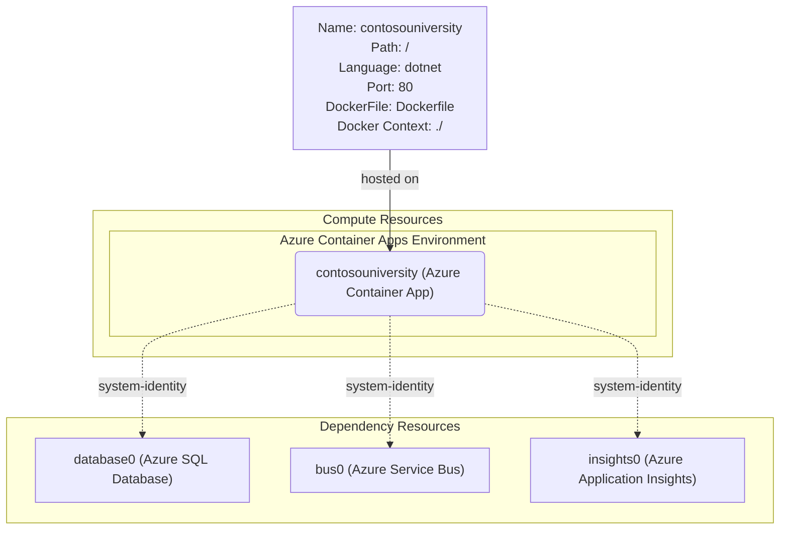

# Azure Deployment Plan for ContosoUniversity Project

## **Goal**
Deploy the modernized Contoso University .NET 9 application to Azure using AZD with containerized hosting and cloud-native services.

## **Project Information**

**AppName**: ContosoUniversity
- **Technology Stack**: .NET 9 ASP.NET Core MVC application (upgraded from .NET Framework)
- **Application Type**: University management system with CRUD operations for students, courses, instructors, and departments
- **Containerization**: Ready for deployment with optimized Dockerfile for .NET 9
- **Dependencies**: 
  - Azure SQL Database (replaces SQL Server LocalDB)
  - Azure Service Bus (replaces MSMQ messaging)
  - Application Insights for monitoring
- **Hosting Recommendation**: Azure Container Apps for auto-scaling, zero-downtime deployments, and cost-effective serverless container hosting
- **Key Features**: 
  - Entity Framework Core 9.0 with Code First migrations
  - Real-time notification system using Azure Service Bus
  - Bootstrap 5 responsive UI
  - Managed Identity authentication throughout

## **Azure Resources Architecture**

> **Install the mermaid extension in IDE to view the architecture.**

**Data Flow:**
- The Container App is deployed from the Docker image built from the application source code
- Web requests are routed through the Container Apps ingress controller to the application
- The application connects to Azure SQL Database using Managed Identity for secure, credential-free authentication
- Entity operations trigger notifications sent to Azure Service Bus queues for reliable message processing
- All telemetry, logs, and performance metrics are collected by Application Insights for monitoring and diagnostics
- Container Apps auto-scales based on HTTP traffic and resource utilization

## **Recommended Azure Resources**

### Application Services
**Application: ContosoUniversity**
- **Hosting Service Type**: Azure Container Apps
- **SKU**: Consumption-based pricing with auto-scaling (0.5 vCPU, 1Gi memory per container)
- **Configuration**:
  - Language: dotnet
  - DockerFilePath: ./Dockerfile
  - DockerContext: ./
  - Environment Variables:
    - `APPLICATIONINSIGHTS_CONNECTION_STRING`
    - `ConnectionStrings__DefaultConnection`
    - `NotificationQueue__ServiceBusNamespace`
    - `NotificationQueue__QueueName`
    - `AZURE_CLIENT_ID`

### Dependency Resources

**Azure SQL Database**
- **SKU**: Basic tier (5 DTUs, 2GB storage) - suitable for development/testing
- **Service Type**: Azure SQL Database
- **Connection Type**: Managed Identity with Azure AD authentication
- **Environment Variables**: `ConnectionStrings__DefaultConnection`

**Azure Service Bus**
- **SKU**: Standard tier with messaging capabilities
- **Service Type**: Azure Service Bus Namespace with notifications queue
- **Connection Type**: Managed Identity authentication
- **Environment Variables**: 
  - `NotificationQueue__ServiceBusNamespace`
  - `NotificationQueue__QueueName`

### Supporting Services
- **Application Insights**: Standard tier for comprehensive monitoring and analytics
- **Log Analytics Workspace**: Centralized logging for all services
- **Container Apps Environment**: Managed Kubernetes environment for container orchestration

### Security Configurations
**Container App Security**:
- **User Managed Identity**: Automatically assigned to the Container App for secure service authentication
- **SQL Database Role**: SQL DB Contributor role assigned to the managed identity
- **Service Bus Role**: Azure Service Bus Data Owner role assigned to the managed identity

## **Execution Steps**

> **Below are the steps for Copilot to follow; ask Copilot to update or execute this plan.**

1. **Provision Azure Infrastructure and Deploy the Application:**
   1. Infrastructure files have been generated (Bicep templates in `/infra` directory)
   2. Pre-check: All Bicep files have been validated for syntax and dependencies
   3. Run the AZD command `azd up` to provision the resources and deploy the application
   4. Verify each Azure resource is created successfully:
      - Resource Group
      - Container Apps Environment with Log Analytics
      - Azure SQL Database with Managed Identity authentication
      - Azure Service Bus with notifications queue
      - Application Insights
      - Container App with proper role assignments
   5. Check the deployment output and application health endpoints
   6. Verify application logs using the `appmod-get-azd-app-logs` tool

2. **Post-Deployment Validation:**
   1. Test the application functionality through the Container App FQDN
   2. Verify database connectivity and Entity Framework migrations
   3. Test the notification system with CRUD operations
   4. Monitor Application Insights for telemetry data
   5. Validate auto-scaling behavior under load

3. **Summary:**
   1. Use `appmod-summarize-result` tool to generate deployment summary and documentation